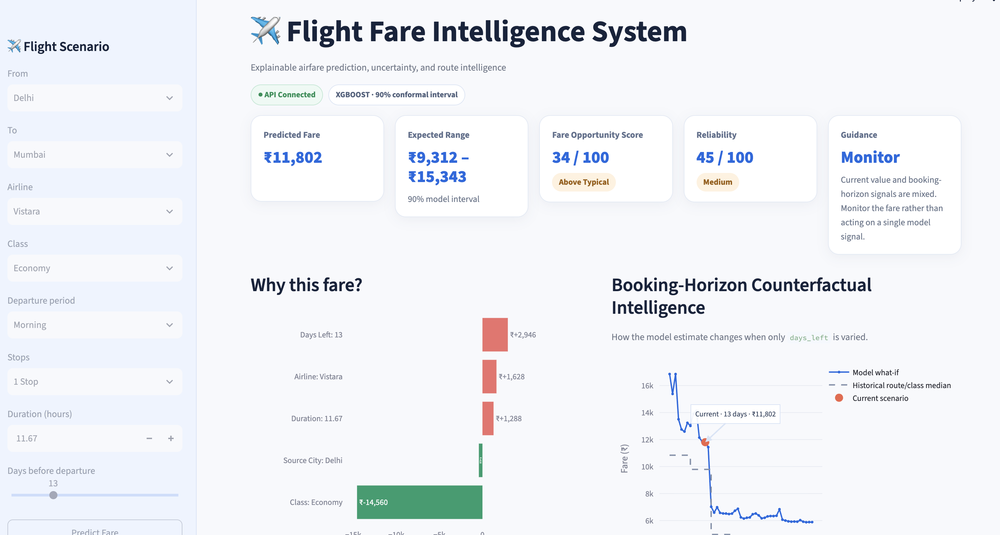
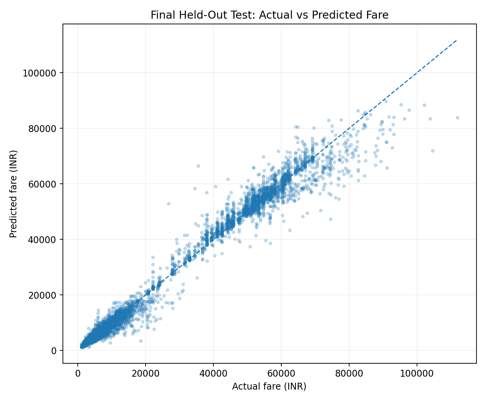
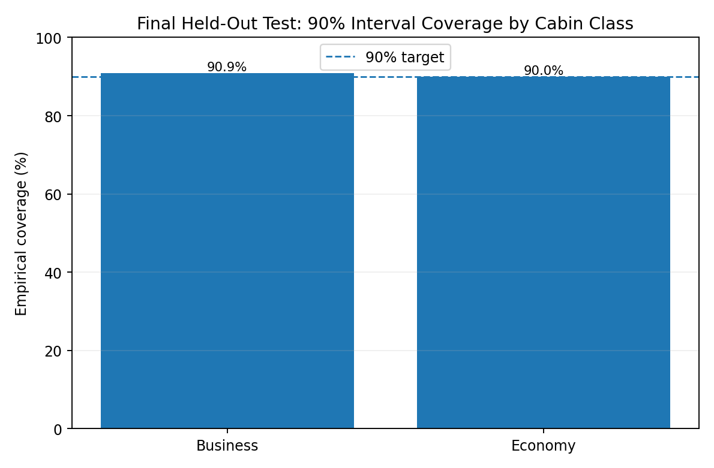
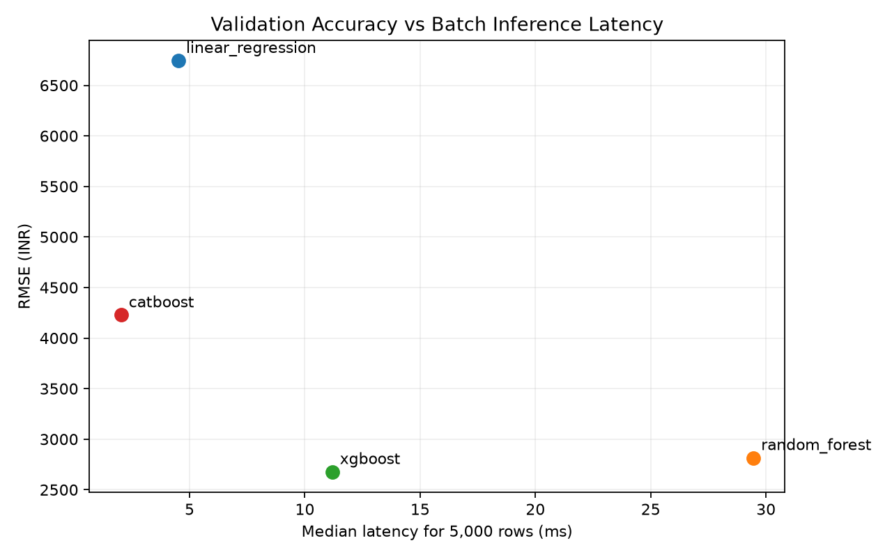
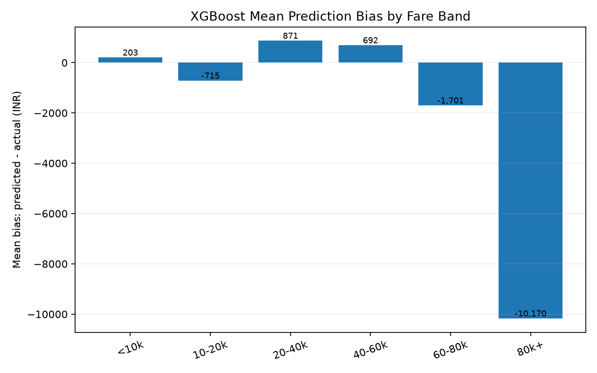
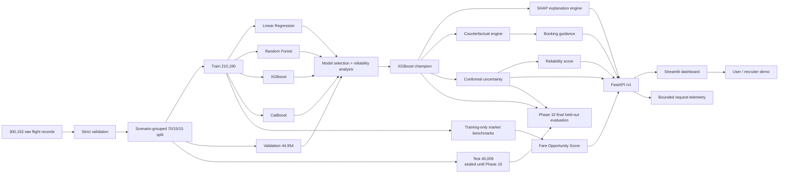

# ✈️ Flight Fare Intelligence System

[](https://github.com/PramodhKH/flight-fare-intelligence-system/actions/workflows/ci.yml)


An end-to-end **airfare decision-intelligence platform** built on **300,153 flight records**. The system does more than predict ticket prices: it quantifies uncertainty, explains fare drivers, benchmarks the prediction against comparable historical flights, simulates booking decisions, and serves the complete experience through **FastAPI + Streamlit**.

> **Final held-out test:** RMSE **₹2,670.07** · MAE **₹1,403.75** · R² **0.9862** · MAPE **10.38%** · 90% interval coverage **90.28%**



---

## Why this project is different

A typical flight-fare portfolio project ends at `model.predict()`.

This one was designed as a production-oriented ML system:

| Basic fare-prediction project | Flight Fare Intelligence System |
| --- | --- |
| Random train/test split | **Scenario-grouped, leakage-safe 70/15/15 split** |
| One regression model | **Linear Regression → Random Forest → XGBoost → CatBoost** |
| RMSE only | RMSE, MAE, R², MAPE, latency, model size, segment reliability |
| Point estimate | **90% conformal prediction interval** |
| Feature importance | **Global + local SHAP explanations** |
| No pricing context | **Fare Opportunity Score + route/class/horizon benchmark** |
| Static prediction | **1–49 day counterfactual booking-horizon engine** |
| No decision layer | **BUY NOW / MONITOR / WAIT OR MONITOR guidance** |
| Notebook | **FastAPI service + Streamlit dashboard + Docker + CI + telemetry** |

---

## Final results

### Held-out test performance

The **45,009-row test set remained sealed throughout model selection, reliability analysis, explainability, uncertainty calibration, API development, and dashboard development. It was first scored in Phase 10, after all model and product decisions were locked. No post-test retuning is allowed.**

| Metric | Final held-out test |
| --- | ---: |
| RMSE | **₹2,670.07** |
| MAE | **₹1,403.75** |
| R² | **0.9862** |
| MAPE | **10.38%** |
| Median absolute error | **₹640.47** |
| P90 absolute error | **₹3,488.67** |
| 90% interval coverage | **90.28%** |
| Median 90% interval width | **₹3,706.09** |

The final test result closely tracks validation performance (**₹2,677.55 RMSE / 0.9861 R²**), which supports the stability of the model-selection process rather than suggesting validation overfitting.



The conformal layer also retained the intended coverage behavior on untouched data:



### Segment reliability

| Segment | Test RMSE | Test MAE | Key observation |
| --- | ---: | ---: | --- |
| Economy | **₹1,461.93** | ₹834.71 | Strong absolute accuracy; percentage error remains more sensitive at low fares |
| Business | **₹4,261.72** | ₹2,661.41 | Higher absolute uncertainty due to larger fare scale |
| 1–7 days before departure | **₹4,426.26** | ₹2,696.61 | Last-minute bookings remain the hardest horizon |
| 22–35 days before departure | **₹2,104.97** | ₹1,103.59 | More stable booking window |
| ₹80K+ fares | **₹13,047.48** | ₹10,685.30 | Known high-fare tail weakness persists on unseen data |

The high-fare tail was **not hidden or tuned away** after validation. On the final test set, ₹80K+ fares were underpredicted **93.54%** of the time, confirming the need for wider uncertainty and conservative decision support in that region.

---

## Model progression

| Model | Validation RMSE | MAE | R² | MAPE | 5K-row latency | Artifact size |
| --- | ---: | ---: | ---: | ---: | ---: | ---: |
| Linear Regression | ₹6,744.07 | ₹4,554.28 | 0.9116 | 46.25% | 4.51 ms | 0.005 MB |
| CatBoost | ₹4,227.89 | ₹2,458.36 | 0.9653 | 17.35% | **2.03 ms** | **0.67 MB** |
| Random Forest | ₹2,815.82 | **₹1,366.27** | 0.9846 | **9.76%** | 29.45 ms | 169.62 MB |
| **XGBoost** | **₹2,677.55** | ₹1,401.91 | **0.9861** | 10.39% | 11.18 ms | 16.66 MB |

XGBoost was selected using an **RMSE-first validation policy** with MAE, inference latency, and model size as production tie-breakers. Random Forest remained the strongest runner-up but was roughly 10× larger and slower at batch inference.



---

## Leakage-safe evaluation

The raw dataset contains **10,434 rows that repeat an already-observed deployed feature vector**. A conventional seeded row-random split would place **4,679 exact production scenarios across multiple splits**, affecting **9,674 rows**.

The project therefore uses a deterministic **scenario-grouped, stratified split**:

```text
Train        210,190 rows   70.03%
Validation    44,954 rows   14.98%
Test          45,009 rows   15.00%

Exact deployed-scenario overlap across splits: 0
```

All later phases reuse the same assignments.

---

## Explainable fare engine

Phase 6 explains the locked XGBoost model across all 44,954 validation rows and aggregates transformed one-hot SHAP values back to the eight production inputs:

```text
airline
source_city
destination_city
departure_time
stops
class
duration
days_left
```

Global mean absolute SHAP importance was dominated by **cabin class (~69.1%)**, followed by duration, booking horizon, airline, and route components. Segment analysis showed that `days_left` becomes substantially more influential for last-minute Economy bookings, while duration and airline effects grow within Business pricing.

Local explanations preserve additive reconstruction to sub-rupee tolerance, enabling the API and dashboard to answer:

> **Why did the model estimate this fare?**

---

## Reliability and uncertainty

The reliability analysis revealed two recurring hard regions:

- **last-minute bookings**;
- **high-value Business fares**, especially the ₹80K+ tail.



Phase 7 therefore adds a **tail-aware hierarchical asymmetric split-conformal interval** instead of returning only a point estimate.

The uncertainty calibrator was fit on a scenario-preserving half of the validation split and evaluated on the other half before the test set was touched. It achieved **90.46% validation-evaluation coverage** for a nominal 90% target and **90.28% coverage on the final held-out test**.

Reliability is represented as a **comparative uncertainty score based on relative interval width**. It is intentionally **not described as a probability that the model is correct**.

---

## Fare intelligence layer

A prediction is enriched with several decision-support signals.

### Fare Opportunity Score

The model-estimated fare is compared with **training-only historical fares** from the same:

```text
directed route + cabin class + booking horizon
```

The score is defined as `100 - empirical fare percentile`:

| Score | Position |
| ---: | --- |
| 80–100 | Excellent Value |
| 60–79 | Good Value |
| 40–59 | Typical |
| 20–39 | Above Typical |
| 0–19 | Expensive |

### Booking guidance

The system holds every input fixed and varies only `days_left` to create a model counterfactual. It then combines that signal with the current Fare Opportunity Score to return one of:

```text
BUY_NOW
MONITOR
WAIT_OR_MONITOR
```

The guidance is deliberately framed as **historical/model-based decision support**. It does not have live airline inventory and does not claim to forecast guaranteed future fare movements.

---

## System architecture



---

## Product experience

For one scenario, the dashboard can return:

```text
Predicted Fare            ₹11,802
90% Expected Range        ₹9,312 – ₹15,343
Fare Opportunity Score    34 / 100 — Above Typical
Reliability               45 / 100 — Medium
Guidance                  Monitor
```

alongside:

- SHAP price drivers;
- route/class historical benchmarks;
- model-vs-historical booking-horizon intelligence;
- alternative airline/departure/stops what-if comparisons;
- API telemetry and model metadata.

---

## Production API

FastAPI exposes a versioned `/v1` contract:

| Method | Endpoint | Purpose |
| --- | --- | --- |
| GET | `/v1/health` | Readiness / artifact health |
| GET | `/v1/model` | Public model metadata |
| GET | `/v1/telemetry` | Bounded local request telemetry |
| POST | `/v1/predict` | Full fare-intelligence prediction |
| POST | `/v1/predict/batch` | Bounded batch inference, max 100 scenarios |
| POST | `/v1/what-if` | One-feature-at-a-time counterfactual comparison |
| POST | `/v1/booking-horizon` | 1–49 day model/historical horizon payload |
| GET | `/v1/routes` | Available directed routes |
| GET | `/v1/route-analytics` | Training-only route/class market context |

OpenAPI documentation is available at:

```text
http://localhost:8000/docs
```

---

## Run locally

### 1. Environment

```bash
python3.11 -m venv .venv
source .venv/bin/activate
python -m pip install --upgrade pip setuptools wheel
pip install -e ".[dev]"
```

### 2. Add the dataset

The raw CSV is intentionally not committed. Place it at:

```text
data/raw/Flight_Booking.csv
```

### 3. Reproduce the ML artifacts

```bash
make phase2
make phase3
make phase4
make phase5
make phase6
make phase7
```

### 4. Run the product

Terminal 1:

```bash
make api
```

Terminal 2:

```bash
make dashboard
```

Then open:

```text
Dashboard  http://localhost:8501
API        http://localhost:8000
Swagger    http://localhost:8000/docs
```

Or run the two-service Docker stack:

```bash
make stack
```

---

## Final quality gate

Phase 10 runs the Phase 9 production smoke test, performs the **first held-out test evaluation**, applies safe Ruff autofixes/formatting, runs a strict lint gate, and executes the full automated suite:

```bash
make phase10
```

Expected final result:

```text
72 passed
All checks passed!
```

The project also includes:

- Docker + Docker Compose;
- GitHub Actions CI;
- strict Pydantic request validation;
- request IDs and latency headers;
- bounded batch inference;
- in-memory API telemetry;
- reproducible phase-gated experiment history.

---

## Repository structure

```text
api/                         FastAPI application
frontend/                    Streamlit dashboard
src/flight_fare_intelligence/
  analytics.py               market analytics
  splitting.py               leakage-safe scenario grouping
  modeling.py                model pipelines and metrics
  reliability.py             segment robustness diagnostics
  explainability.py          SHAP aggregation and local explanations
  uncertainty.py             conformal prediction intervals
  intelligence.py            scoring and decision-support logic
  service.py                 production intelligence engine
  monitoring.py              lightweight API telemetry
scripts/                     phase execution and validation gates
tests/                       automated regression/integration tests
docs/assets/                 recruiter-facing screenshots/figures
legacy/                      original Intellipaat project evidence
```

---

## Limitations

This system is intentionally explicit about what the dataset can and cannot support:

1. **No live airline inventory or pricing feed.** Predictions reflect patterns learned from the historical dataset.
2. **Counterfactual booking curves are not temporal forecasts.** Tree-model discontinuities can occur when `days_left` crosses learned splits.
3. **High-value fares remain harder.** The ₹80K+ tail shows systematic underprediction even on the final held-out test.
4. **Prediction intervals are empirical, not guarantees.** Coverage is evaluated at the population/segment level.
5. **Fare Opportunity Score is contextual, not a claim that a ticket is objectively cheap.** It compares the model estimate with training-only historical comparables.

These limitations are surfaced in the product rather than hidden from the user.

---

## Project evolution

The repository was built phase-by-phase rather than as a single notebook dump:

1. Engineering foundation and data contract
2. Market intelligence and leakage-safe splitting
3. Linear Regression baseline
4. RF / XGBoost / CatBoost benchmark
5. Reliability and robustness diagnostics
6. SHAP explainability
7. Uncertainty and decision intelligence
8. FastAPI production service
9. Streamlit dashboard and hardening
10. Final held-out evaluation and portfolio release

See [`PHASE_10.md`](PHASE_10.md) for the final release record and [`docs/portfolio_snippets.md`](docs/portfolio_snippets.md) for resume/LinkedIn-ready descriptions.

---

## Portfolio positioning

**Flight Fare Intelligence System** demonstrates the complete path from raw tabular data to an explainable production ML product: leakage-safe evaluation, nonlinear model benchmarking, segment reliability, uncertainty quantification, SHAP explanations, market-context scoring, counterfactual decision support, API engineering, frontend development, Docker, CI, testing, and observability.
